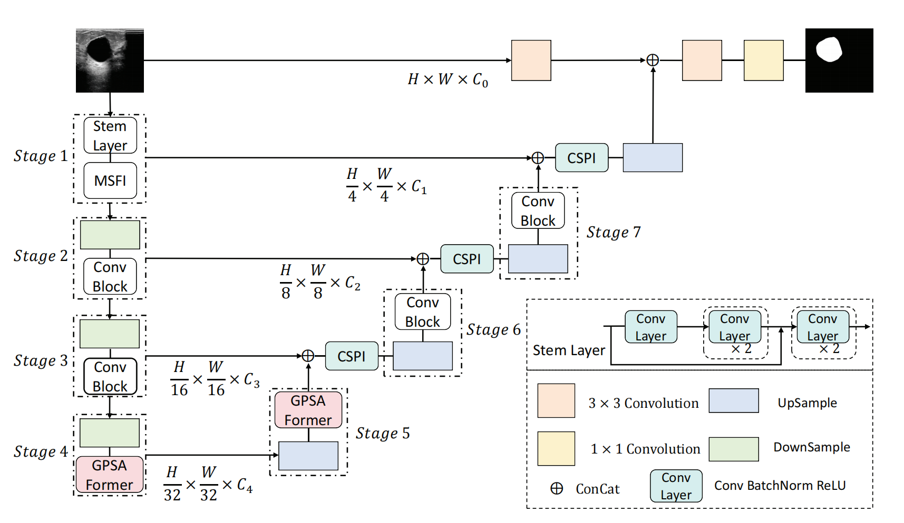

## Introduction
TransUNETR has successfully demonstrated the viability of integrating self-attention mechanisms into gated convolutional modules in the field of medical image segmentation. Our approach has achieved outstanding results on five datasets, including Kvasir-SEG, CVC-ClinicDB, ISIC2018, BUSI, and GlaS.
<p align="center">
  
</p>


## Implementation
- The experimental environment of this paper includes:
Ubuntu 20.04 LTS system, an NVIDIA RTX A10 GPU, Python version 3.8, Pytorch version 1.13, and CUDA version 11.6.

- Clone this repository:
```bash
git clone https://github.com/apuomline/trasnunetr.git
cd transunetr
```


### Datasets
1) ISIC 2018 - [Link](https://challenge.isic-archive.com/data/)
2) BUSI - [Link](https://www.kaggle.com/aryashah2k/breast-ultrasound-images-dataset)
3) GLAS - [Link](https://websignon.warwick.ac.uk/origin/slogin?shire=https%3A%2F%2Fwarwick.ac.uk%2Fsitebuilder2%2Fshire-read&providerId=urn%3Awarwick.ac.uk%3Asitebuilder2%3Aread%3Aservice&target=https%3A%2F%2Fwarwick.ac.uk%2Ffac%2Fcross_fac%2Ftia%2Fdata%2Fglascontest&status=notloggedin)
4) CHASEDB1 - [Link](https://blogs.kingston.ac.uk/retinal/chasedb1/)


### Data Format
- Make sure to put the files as the following structure. For binary segmentation, just use folder 0.
```
inputs
└── <dataset name>
    ├── images
    |   ├── 001.png
    │   ├── 002.png
    │   ├── 003.png
    │   ├── ...
    |
    └── masks
        └── 0
            ├── 001.png
            ├── 002.png
            ├── 003.png
            ├── ...
```


### Training and Validation
- Train the model.
```
  python  train.py --dataset Dataset_name --input_w 256 --input_h 256 --img_ext .png --mask_ext .png --epochs 300 --name TransUNETR -b 6 
```
- Evaluate.
```
  python  val.py  --name model_name
```


## Acknowledgements
This code repository is implemented based on [UNeXt](https://github.com/jeya-maria-jose/UNeXt-pytorch) and [Rolling-Unet](https://github.com/Jiaoyang45/Rolling-Unet). 


## References
1) UNet, UNet++, Attention-UNet - [link](https://github.com/bigmb/Unet-Segmentation-Pytorch-Nest-of-Unets)
2) Medical-Transformer - [link](https://github.com/jeya-maria-jose/Medical-Transformer)
3) UCTransNet - [link](https://github.com/McGregorWwww/UCTransNet?tab=readme-ov-file)
4) UNeXt - [link](https://github.com/jeya-maria-jose/UNeXt-pytorch)
5) DconnNet - [link](https://github.com/Zyun-Y/DconnNet)
6) Rolling-Unet - [link](https://github.com/Jiaoyang45/Rolling-Unet)


## Citations


